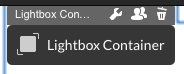

# LightboxContainer
Container that lays over the page and dims the background. Used to guide the user into a sub-flow without leaving the page.

## Information
|  name |  version |  bundle |
|--|:--:|--:|
|  container-lightbox |  1.0.5 |  Universal |

## Features
|  Feature |  Description |
|--|--|
|  Open / close Lightbox |  Using behaviors, the Lightbox can be opened and closed. The Lightbox can also be closed using the Close button. |
|  Display content |  The Lightbox dims the background, opens centered on the screen |
|  Managing Lightbox |  When in edit mode, the Lightbox is presented as a button on the page. It allows the page editor to access the Lightbox and its settings. |

## Product Description
Container that lays over the page and dims the background. It can be filled with any other widget or container. Used to guide the user into a sub-flow without leaving the page. 

## Screenshots

